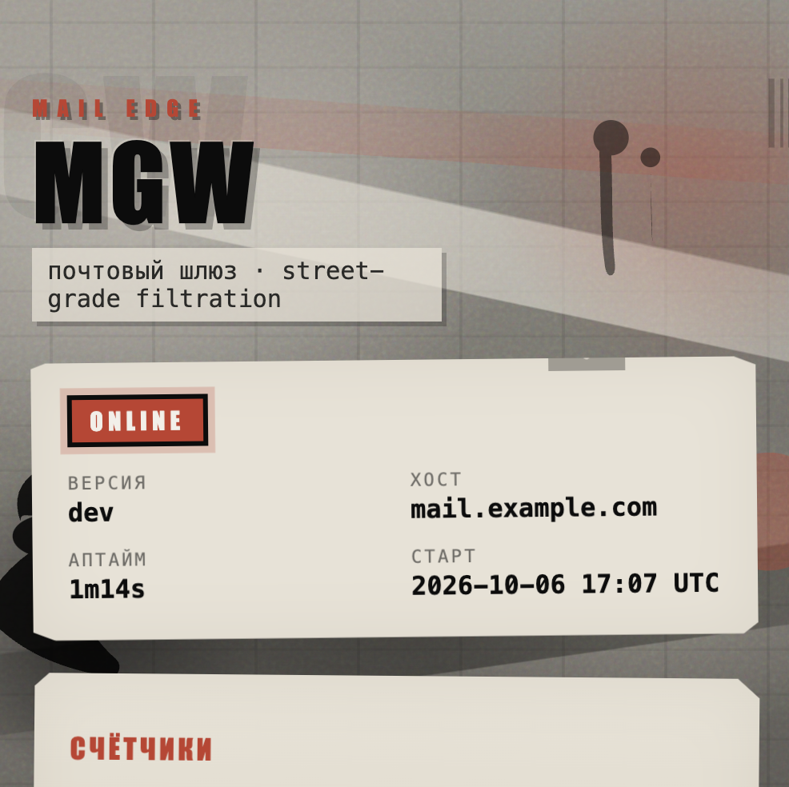

# Mail Gateway (mgw)

Почтовый шлюз (MTA / Mail Security Gateway) на Go: один статически скомпилированный бинарник.

**Автор:** Кислов Роман Сергеевич  
**Лицензия:** [Apache License 2.0](LICENSE)



## Этап 1 (текущий)

- SMTP-приём (ESMTP, STARTTLS, опционально SMTPS :465)
- MIME-разбор, дисковая очередь, relay
- YAML-конфиг + CLI
- Управление сертификатами, УЦ и ACME-клиент
- `/healthz`, статус-страница

## Быстрый старт

```bash
make build
./mgw config init --config config.yaml
# для разработки без root смените listen на 127.0.0.1:2525
./mgw cert selfsigned --domain mail.example.com --config config.yaml
./mgw server start --config config.yaml
```

По умолчанию:

| Сервис | Адрес |
|--------|--------|
| SMTP   | `0.0.0.0:25` |
| Web    | `0.0.0.0:8443` |
| ACME   | `:80` (если включён) |

Порты и TLS полностью задаются в `config.yaml`.

## Сертификаты

```bash
# Self-signed (dev)
mgw cert selfsigned --domain mail.example.com

# Импорт существующих PEM
mgw cert import --cert fullchain.pem --key privkey.pem

# УЦ
mgw cert ca add /path/to/corp-root.pem
mgw cert ca list

# ACME (Let's Encrypt) — в конфиге: tls.acme.enabled, email, agree_tos, domains
mgw cert acme issue --domain mail.example.com
mgw cert acme status
mgw cert acme renew

mgw cert list
mgw cert show live
```

Хранилище: `$data_dir/certs/` (`live/`, `ca/`, `acme/`).

## CLI

```
mgw server start|status|version
mgw config init|validate|show
mgw cert list|show|import|delete|selfsigned
mgw cert ca list|add|remove
mgw cert acme status|issue|renew
```

## Конфигурация

См. [configs/config.example.yaml](configs/config.example.yaml). Поддержка `${ENV}`.

## Сборка

```bash
make build   # CGO_ENABLED=0
make test
```
