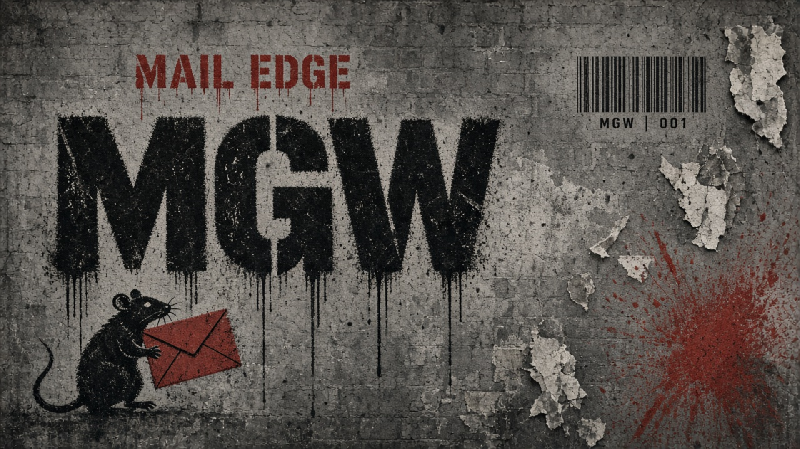
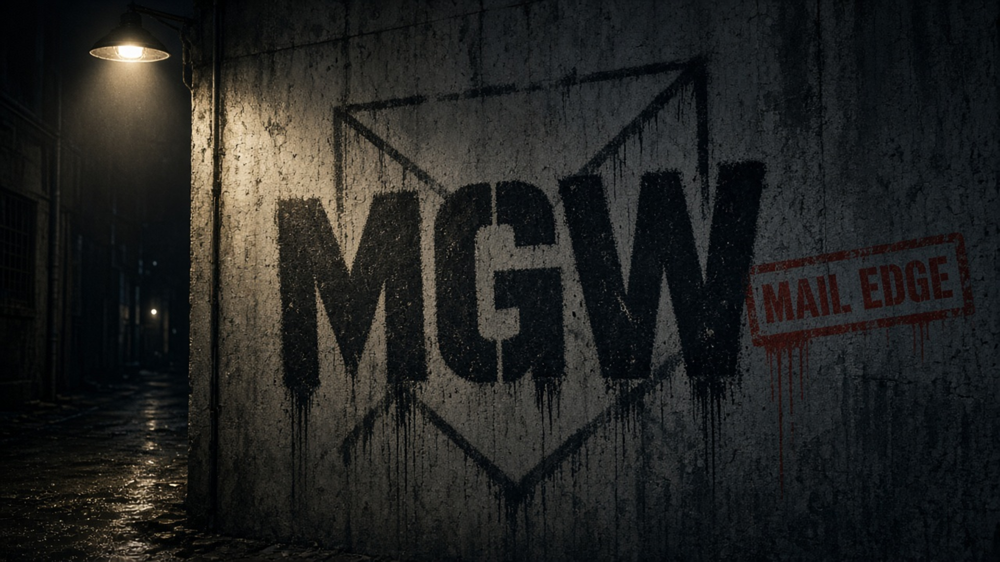

# Wallpaper pack — Mail Gateway (mgw)

Street-art обои в стиле статус-страницы mgw (бетон, stencil, красный акцент).

**Автор:** Кислов Роман Сергеевич · Apache-2.0

## Состав

| Путь | Назначение |
|------|------------|
| `masters/` | исходники (day / night / phone / tablet) |
| `svg/mgw-wall.svg` | векторный мастер — идеален для любого Retina |
| `desktop/` | 16:9 и 16:10, `@2x` / `@3x` |
| `mobile/` | портрет, `@2x` / `@3x` (iPhone) |
| `tablet/` | iPad `@2x` |

## Retina / размеры

Собрать полный pack (нужен [ImageMagick](https://imagemagick.org)):

```bash
chmod +x wallpapers/export.sh
./wallpapers/export.sh
```

Появится `wallpapers/mgw-wallpaper-pack.zip` со всеми разрешениями:

**Desktop:** 1920×1080, 2560×1440, 2560×1600, 2880×1800, 3024×1964, 3456×2234, **3840×2160 (4K/@2x)**, **5120×2880 (5K)**, **7680×4320 (@3x)**  
**iPhone @3x:** 1170×2532, 1284×2778, 1290×2796  
**iPad @2x:** 1668×2388, 2048×2732

Готовый zip также в [Releases](https://github.com/rkislov/mailedge/releases).

## Превью

Day:



Night:


